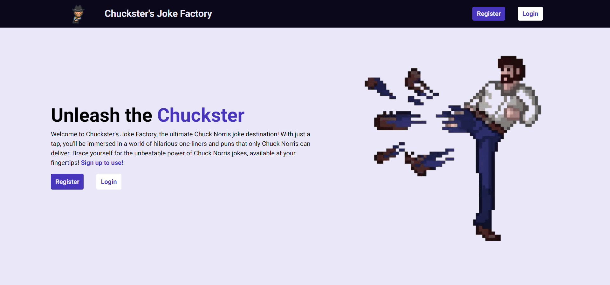
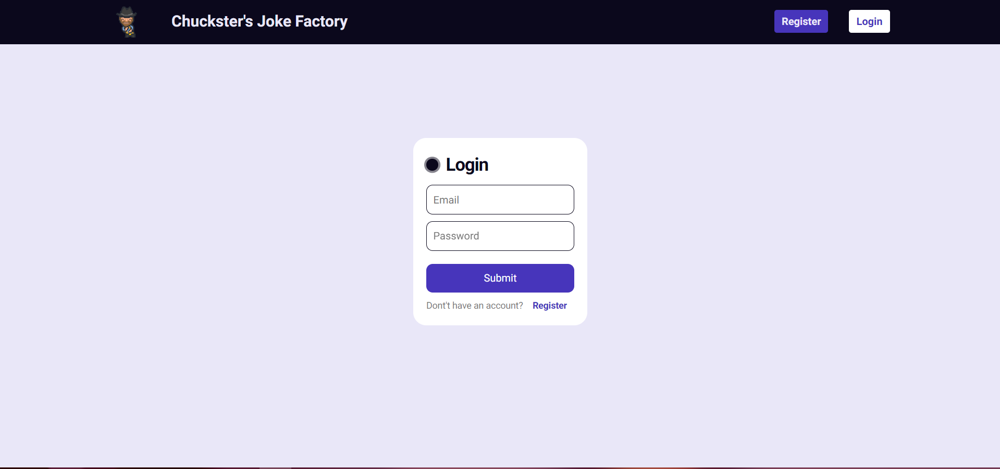
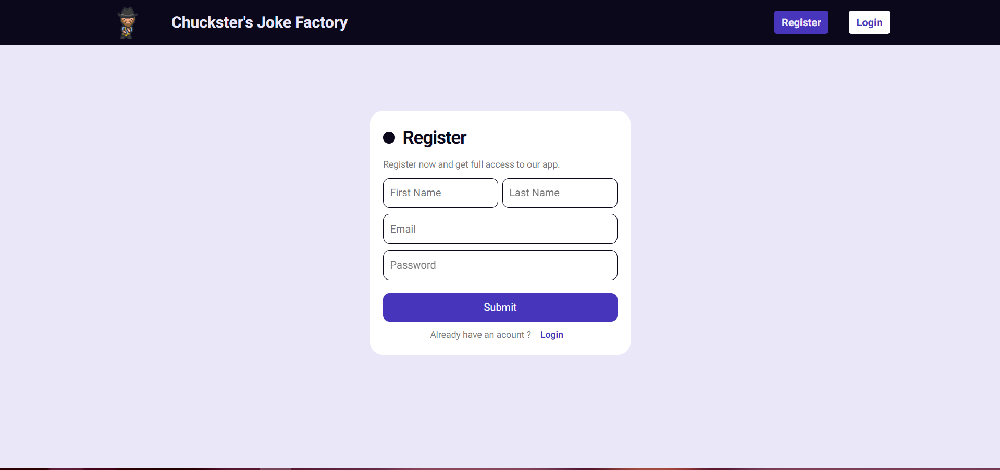
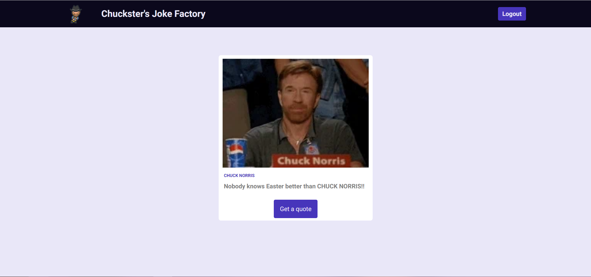

# Chuckster's Joke Factory

Chuckster's Joke Factory is a web application built with Node.js and TypeScript. It allows users to register, login, and fetch random Chuck Norris jokes from an API.

## Development Practices

- Developed using Node.js and TypeScript.
- Database: MongoDB and Mongoose
- Tested with Jest for unit testing.
- Followed best practices with ESLint for code quality.
- Code formatting maintained with Prettier for consistency.

## Table of Contents

- [Installation](#installation)
- [Features](#features)
- [Usage](#usage)
- [Screens](#screens)
- [Contact](#contact)

## Installation

To run the Chuck Norris Jokes Generator locally, follow these steps:

1. Clone the repository:

   ```
   git clone https://github.com/Radule6/chuck-norris.git
   ```

2. Install the project dependencies:

   ```
   cd chuck-norris/backend
   npm install
   ```

3. Configure the environment variables:

   - Rename the `.env-example` located in the backend folder file to `.env`.
   - Update the necessary environment variables such as API keys, database connection details, etc.

4. Start the application:

   ```
   npm run dev
   ```

5. Open your web browser and access the application at `http://localhost:8000`.

## Features

- User Registration: Users can create a new account by providing their email and password. They will receive a confirmation email to verify their account.
- Login: Registered users can log in to the application using their email and password.
- Email Confirmation: After registration, users will receive an email with a confirmation link to activate their account.
- Fetch Jokes: Once logged in, users can fetch random Chuck Norris jokes from the API with a single click.

## Usage

1. Register: On the registration page, provide your email and choose a password to create a new account.
2. Email Confirmation: Check your inbox and click on the confirmation link to activate your account.
3. Login: Use your registered email and password to log in to the application.
4. Fetch Jokes: Once logged in, click on the "Fetch Joke" button to retrieve a random Chuck Norris joke from the API.

## Screens


_Caption: Home page where the user can log in and register to the system_

_Caption: The login page where users can enter their credentials to log in._

_Caption: The register page where users can enter their credentials to register to the system._

_Caption: The dashboard page where users can get Chuck Norris jokes._

## Contact

If you have any questions or feedback regarding this project, please feel free to reach out:

- Email: [marko.radulovic@mradulovic.com](mailto:marko.radulovic@mradulovic.com)
- GitHub: [Radule6](https://github.com/your-username)
